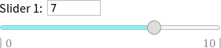

# Sliders.js
### *Simple and beautifull sliders in pure JavaScript!*

Sliders.js allows add practical, value sliders as inputs to your HTML forms.

> 

## Futures

### 1. Easy to setup

First **download** files: [CreateSuperElement.js](https://github.com/BlueManCZ/JavaScript-components/blob/master/CreateSuperElement.js/CreateSuperElement.js), [sliders.js](https://github.com/BlueManCZ/JavaScript-components/blob/master/Sliders.js/sliders.js) and [slider.css](https://github.com/BlueManCZ/JavaScript-components/blob/master/Sliders.js/slider.css).

Then **import** this files to your HTML file:
##### JavaScript in <body\>
```
<script type="text/javascript" src="sliders.js"></script>
<script type="text/javascript" src="CreateSuperElement.js"></script>
```
##### CSS in <head\>
```
<link rel=stylesheet href="slider.css">
```
### 2. Easy to use
You can easily create slider as HTML input.
```
<input type="text" class="slider1" name="value1" text="Value 1:">
```

**Important!** Each slider must have class slider1 and different name attribute!

### 3. Customizable

There are many attributes, which can modify slider's functionalities.

**Here is list of them:**

- **text**="visible slider title"
- **min**="number" - Lower boundary of slider, must be lower than max.
- **max**="number" - Upper boundary of slider, must be higher than min.
- **value**="number" - Default value of slider.
- **round**="number" - Decimal places of value rounding.
- **animate**="yes/no" - Choose one for enable or disable slider animation. (default is yes)
- **smooth**="yes/no" - Smooth movement of small range slider. (default is no)